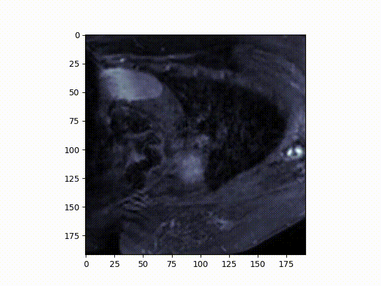

#  Cardiac Atrium Segmentation — Educational Project

This repository is part of an **educational series** designed to teach the fundamentals of **medical image segmentation** using deep learning.  
Our main goal here was **to understand and implement the U-Net architecture**, not necessarily to achieve state-of-the-art accuracy.

---

##  Project Goal

The purpose of this project was to:

- Learn how MRI and segmentation masks are loaded and visualized.
- Understand the **U-Net** architecture and how skip connections preserve spatial information.
- Implement a **custom training loop** using **PyTorch Lightning** for better structure and logging.
- Train the model on a **private cardiac MRI dataset** (not publicly available).
- Visualize predictions and segmentation masks during the training process.

>  The dataset used in this project is private and cannot be shared publicly.

---


##  Model Overview

The core of this project is a **U-Net** model, a popular encoder–decoder architecture for biomedical image segmentation.  
We implemented it from scratch to clearly understand each component.

| Component | Description |
|-----------|-------------|
| **Encoder** | Extracts features and reduces spatial dimensions using `Conv + ReLU + MaxPool`. |
| **Decoder** | Upsamples and fuses features from earlier layers to recover spatial detail. |
| **Skip Connections** | Preserve fine details lost during downsampling. |
| **Final Layer** | Uses `Sigmoid` activation to produce a binary segmentation map. |


---

##  Dataset and Augmentation

Although the dataset is private, each sample consisted of:

- A 2D MRI slice.
- Its corresponding binary mask representing the atrium.

We applied basic augmentations using **imgaug**:

- Random rotation (`-45° to +45°`)
- Scaling (`0.85x to 1.15x`)
- Elastic deformation


---

##  Training

Training was performed using **PyTorch Lightning** for cleaner code and automatic logging:

```python
trainer = pl.Trainer(
    accelerator="gpu", 
    devices=1,
    logger=TensorBoardLogger(save_dir="./logs"),
    callbacks=[checkpoint_callback],
    max_epochs=30
)
```
## Loss function:
```
DiceLoss = 1 - (2 * intersection) / (sum(pred) + sum(mask))
```

## Layer-by-Layer Segmentation Visualization

The following animation shows the segmentation mask overlaid on the MRI slice-by-slice (like a mini video):



## Key Takeaways

* Implementing U-Net manually is a great way to understand skip connections and multi-scale feature fusion.

* Dice Loss is well-suited for medical segmentation where foreground pixels are sparse.

* Using PyTorch Lightning simplifies the training loop and improves experiment management.

* Visualization is often more insightful than raw metrics, especially for educational projects.

## Future Work

* Experiment with attention-based U-Net.

* Try 3D U-Net for volumetric segmentation.

* Integrate more advanced augmentations (e.g., contrast adjustment, brightness).

